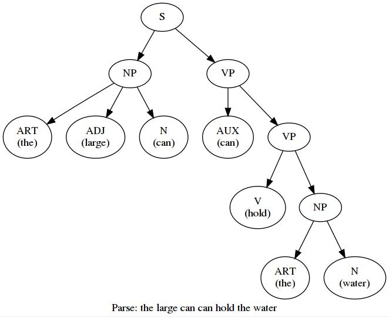

# chart-parse
线图法句子成分解析

```text
待处理的句子：The large can can hold the water

#Step[01] - 待处理表：((ART<the>), 0, 1); 
              活动边：
--------------------------------------------------------------------------------------------------
	->获取新成分：((ART<the>), 0, 1)
	->生成活动边: ((•ART ADJ N), 0, 1)
	->生成活动边: ((•ART N), 0, 1)
	->移进活动边: ((•ART ADJ N), 0, 1) -> ((ART •ADJ N), 0, 1)
	->移进活动边: ((•ART N), 0, 1) -> ((ART •N), 0, 1)

#Step[02] - 待处理表：((ADJ<large>), 1, 2); 
              活动边：((ART •N), 0, 1); ((ART •ADJ N), 0, 1);
--------------------------------------------------------------------------------------------------
	->获取新成分：((ADJ<large>), 1, 2)
	->生成活动边: ((•ADJ N), 1, 2)
	->移进活动边: ((ART •ADJ N), 0, 1) -> ((ART ADJ •N), 0, 2)
	->移进活动边: ((•ADJ N), 1, 2) -> ((ADJ •N), 1, 2)

#Step[03] - 待处理表：((N<can>), 2, 3); ((AUX<can>), 2, 3); ((V<can>), 2, 3); 
              活动边：((ART ADJ •N), 0, 2); ((ART •N), 0, 1); ((ADJ •N), 1, 2);
--------------------------------------------------------------------------------------------------
	->获取新成分：((N<can>), 2, 3)
	->生成活动边: 没有找到匹配的短语
	->移进活动边: ((ART ADJ •N), 0, 2) -> ((ART ADJ N•), 0, 3)
	->规约新成分: ((ART ADJ N•), 0, 3) -> ((NP<the large can>), 0, 3)
	->移进活动边: ((ADJ •N), 1, 2) -> ((ADJ N•), 1, 3)
	->规约新成分: ((ADJ N•), 1, 3) -> ((NP<large can>), 1, 3)

#Step[04] - 待处理表：((AUX<can>), 2, 3); ((V<can>), 2, 3); ((NP<the large can>), 0, 3); ((NP<large can>), 1, 3); 
              活动边：((ADJ N•), 1, 3); ((ART ADJ N•), 0, 3); ((ART •N), 0, 1);
--------------------------------------------------------------------------------------------------
	->获取新成分：((AUX<can>), 2, 3)
	->生成活动边: ((•AUX VP), 2, 3)
	->移进活动边: ((•AUX VP), 2, 3) -> ((AUX •VP), 2, 3)

#Step[05] - 待处理表：((V<can>), 2, 3); ((NP<the large can>), 0, 3); ((NP<large can>), 1, 3); 
              活动边：((ADJ N•), 1, 3); ((ART ADJ N•), 0, 3); ((AUX •VP), 2, 3); ((ART •N), 0, 1);
--------------------------------------------------------------------------------------------------
	->获取新成分：((V<can>), 2, 3)
	->生成活动边: ((•V NP), 2, 3)
	->移进活动边: ((•V NP), 2, 3) -> ((V •NP), 2, 3)

#Step[06] - 待处理表：((NP<the large can>), 0, 3); ((NP<large can>), 1, 3); 
              活动边：((V •NP), 2, 3); ((ADJ N•), 1, 3); ((ART ADJ N•), 0, 3); ((AUX •VP), 2, 3); 
		      ((ART •N), 0, 1);
--------------------------------------------------------------------------------------------------
	->获取新成分：((NP<the large can>), 0, 3)
	->生成活动边: ((•NP VP), 0, 3)
	->移进活动边: ((•NP VP), 0, 3) -> ((NP •VP), 0, 3)

#Step[07] - 待处理表：((NP<large can>), 1, 3); 
              活动边：((V •NP), 2, 3); ((ADJ N•), 1, 3); ((NP •VP), 0, 3); ((ART ADJ N•), 0, 3); 
		      ((AUX •VP), 2, 3); ((ART •N), 0, 1);
--------------------------------------------------------------------------------------------------
	->获取新成分：((NP<large can>), 1, 3)
	->生成活动边: ((•NP VP), 1, 3)
	->移进活动边: ((•NP VP), 1, 3) -> ((NP •VP), 1, 3)

#Step[08] - 待处理表：((N<can>), 3, 4); ((AUX<can>), 3, 4); ((V<can>), 3, 4); 
              活动边：((V •NP), 2, 3); ((ADJ N•), 1, 3); ((NP •VP), 1, 3); ((NP •VP), 0, 3); 
		      ((ART ADJ N•), 0, 3); ((AUX •VP), 2, 3); ((ART •N), 0, 1);
--------------------------------------------------------------------------------------------------
	->获取新成分：((N<can>), 3, 4)
	->生成活动边: 没有找到匹配的短语
	->移进活动边: 未找到可移进活动边

#Step[09] - 待处理表：((AUX<can>), 3, 4); ((V<can>), 3, 4); 
              活动边：((V •NP), 2, 3); ((ADJ N•), 1, 3); ((NP •VP), 1, 3); ((NP •VP), 0, 3); 
		      ((ART ADJ N•), 0, 3); ((AUX •VP), 2, 3); ((ART •N), 0, 1);
--------------------------------------------------------------------------------------------------
	->获取新成分：((AUX<can>), 3, 4)
	->生成活动边: ((•AUX VP), 3, 4)
	->移进活动边: ((•AUX VP), 3, 4) -> ((AUX •VP), 3, 4)

#Step[10] - 待处理表：((V<can>), 3, 4); 
              活动边：((V •NP), 2, 3); ((ADJ N•), 1, 3); ((NP •VP), 1, 3); ((NP •VP), 0, 3); 
		      ((ART ADJ N•), 0, 3); ((AUX •VP), 3, 4); ((AUX •VP), 2, 3); ((ART •N), 0, 1);
--------------------------------------------------------------------------------------------------
	->获取新成分：((V<can>), 3, 4)
	->生成活动边: ((•V NP), 3, 4)
	->移进活动边: ((•V NP), 3, 4) -> ((V •NP), 3, 4)

#Step[11] - 待处理表：((N<hold>), 4, 5); ((V<hold>), 4, 5); 
              活动边：((V •NP), 2, 3); ((ADJ N•), 1, 3); ((NP •VP), 1, 3); ((NP •VP), 0, 3); 
		      ((ART ADJ N•), 0, 3); ((AUX •VP), 3, 4); ((AUX •VP), 2, 3); ((ART •N), 0, 1); 
		      ((V •NP), 3, 4);
--------------------------------------------------------------------------------------------------
	->获取新成分：((N<hold>), 4, 5)
	->生成活动边: 没有找到匹配的短语
	->移进活动边: 未找到可移进活动边

#Step[12] - 待处理表：((V<hold>), 4, 5); 
              活动边：((V •NP), 2, 3); ((ADJ N•), 1, 3); ((NP •VP), 1, 3); ((NP •VP), 0, 3); 
		      ((ART ADJ N•), 0, 3); ((AUX •VP), 3, 4); ((AUX •VP), 2, 3); ((ART •N), 0, 1); 
		      ((V •NP), 3, 4);
--------------------------------------------------------------------------------------------------
	->获取新成分：((V<hold>), 4, 5)
	->生成活动边: ((•V NP), 4, 5)
	->移进活动边: ((•V NP), 4, 5) -> ((V •NP), 4, 5)

#Step[13] - 待处理表：((ART<the>), 5, 6); 
              活动边：((V •NP), 2, 3); ((V •NP), 4, 5); ((ADJ N•), 1, 3); ((NP •VP), 1, 3); 
		      ((NP •VP), 0, 3); ((ART ADJ N•), 0, 3); ((AUX •VP), 3, 4); ((AUX •VP), 2, 3); 
		      ((ART •N), 0, 1); ((V •NP), 3, 4);
--------------------------------------------------------------------------------------------------
	->获取新成分：((ART<the>), 5, 6)
	->生成活动边: ((•ART ADJ N), 5, 6)
	->生成活动边: ((•ART N), 5, 6)
	->移进活动边: ((•ART ADJ N), 5, 6) -> ((ART •ADJ N), 5, 6)
	->移进活动边: ((•ART N), 5, 6) -> ((ART •N), 5, 6)

#Step[14] - 待处理表：((N<water>), 6, 7); ((V<water>), 6, 7); 
              活动边：((V •NP), 2, 3); ((V •NP), 4, 5); ((ADJ N•), 1, 3); ((NP •VP), 1, 3); 
		      ((NP •VP), 0, 3); ((ART ADJ N•), 0, 3); ((AUX •VP), 3, 4); ((AUX •VP), 2, 3); 
		      ((ART •N), 0, 1); ((ART •ADJ N), 5, 6); ((ART •N), 5, 6); ((V •NP), 3, 4);
--------------------------------------------------------------------------------------------------
	->获取新成分：((N<water>), 6, 7)
	->生成活动边: 没有找到匹配的短语
	->移进活动边: ((ART •N), 5, 6) -> ((ART N•), 5, 7)
	->规约新成分: ((ART N•), 5, 7) -> ((NP<the water>), 5, 7)

#Step[15] - 待处理表：((V<water>), 6, 7); ((NP<the water>), 5, 7); 
              活动边：((V •NP), 2, 3); ((V •NP), 4, 5); ((ADJ N•), 1, 3); ((NP •VP), 1, 3); 
		      ((NP •VP), 0, 3); ((ART ADJ N•), 0, 3); ((AUX •VP), 3, 4); ((AUX •VP), 2, 3); 
		      ((ART •N), 0, 1); ((ART •ADJ N), 5, 6); ((ART N•), 5, 7); ((V •NP), 3, 4);
--------------------------------------------------------------------------------------------------
	->获取新成分：((V<water>), 6, 7)
	->生成活动边: ((•V NP), 6, 7)
	->移进活动边: ((•V NP), 6, 7) -> ((V •NP), 6, 7)

#Step[16] - 待处理表：((NP<the water>), 5, 7); 
              活动边：((V •NP), 2, 3); ((V •NP), 4, 5); ((ADJ N•), 1, 3); ((NP •VP), 1, 3); 
		      ((NP •VP), 0, 3); ((ART ADJ N•), 0, 3); ((AUX •VP), 3, 4); ((AUX •VP), 2, 3); 
		      ((ART •N), 0, 1); ((V •NP), 6, 7); ((ART •ADJ N), 5, 6); ((ART N•), 5, 7); 
		      ((V •NP), 3, 4);
--------------------------------------------------------------------------------------------------
	->获取新成分：((NP<the water>), 5, 7)
	->生成活动边: ((•NP VP), 5, 7)
	->移进活动边: ((V •NP), 4, 5) -> ((V NP•), 4, 7)
	->规约新成分: ((V NP•), 4, 7) -> ((VP<hold the water>), 4, 7)
	->移进活动边: ((•NP VP), 5, 7) -> ((NP •VP), 5, 7)

#Step[17] - 待处理表：((VP<hold the water>), 4, 7); 
              活动边：((V •NP), 2, 3); ((ART •ADJ N), 5, 6); ((NP •VP), 1, 3); ((NP •VP), 0, 3); 
		      ((ADJ N•), 1, 3); ((V NP•), 4, 7); ((ART N•), 5, 7); ((V •NP), 6, 7); 
		      ((AUX •VP), 2, 3); ((ART ADJ N•), 0, 3); ((ART •N), 0, 1); ((AUX •VP), 3, 4); 
		      ((V •NP), 3, 4); ((NP •VP), 5, 7);
--------------------------------------------------------------------------------------------------
	->获取新成分：((VP<hold the water>), 4, 7)
	->生成活动边: 没有找到匹配的短语
	->移进活动边: ((AUX •VP), 3, 4) -> ((AUX VP•), 3, 7)
	->规约新成分: ((AUX VP•), 3, 7) -> ((VP<can hold the water>), 3, 7)

#Step[18] - 待处理表：((VP<can hold the water>), 3, 7); 
              活动边：((V •NP), 2, 3); ((ART •ADJ N), 5, 6); ((NP •VP), 1, 3); ((NP •VP), 0, 3); 
		      ((ADJ N•), 1, 3); ((V NP•), 4, 7); ((ART N•), 5, 7); ((V •NP), 6, 7); 
		      ((AUX VP•), 3, 7); ((AUX •VP), 2, 3); ((ART ADJ N•), 0, 3); ((ART •N), 0, 1); 
		      ((V •NP), 3, 4); ((NP •VP), 5, 7);
--------------------------------------------------------------------------------------------------
	->获取新成分：((VP<can hold the water>), 3, 7)
	->生成活动边: 没有找到匹配的短语
	->移进活动边: ((NP •VP), 1, 3) -> ((NP VP•), 1, 7)
	->规约新成分: ((NP VP•), 1, 7) -> ((S<large can can hold the water>), 1, 7)
	->移进活动边: ((NP •VP), 0, 3) -> ((NP VP•), 0, 7)
	->规约新成分: ((NP VP•), 0, 7) -> ((S<the large can can hold the water>), 0, 7)
	->新成分能够覆盖整个句子，解析结束!!!

语法结构树：
0:          S
1:     NP       VP       
2:ART ADJ N   AUX VP   
3:               V NP     
4:                ART N     

Save picture of sentence struct to test.jpg
```

